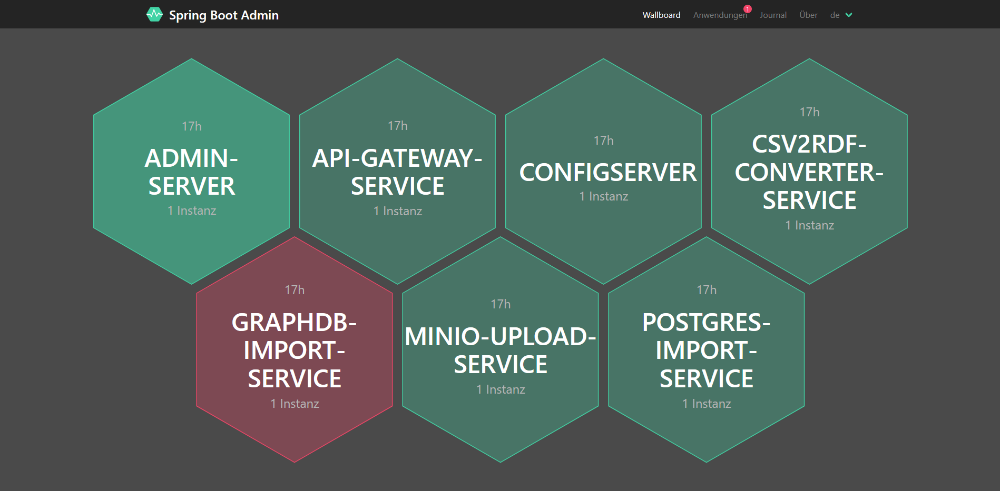

# Microservice Architektur TerrainTwin 

Die Microservie Architektur (MSA) verbindet Programme und Funktionen für das Projekt TerrainTwin und stellt diese über eine einheitlich über eine REST-Schnittstelle bereit. 

- Grundlage für die MSA ist das Spring Boot Framework (Java)
- für die Veröffentlichung der REST-API wird OpenAPI 3 verwendet 
- dieses [Tutorial](https://t2informatik.de/blog/softwareentwicklung/microservices-mit-spring-boot-und-docker-erstellen-teil-1/) wird als Grundlage verwendet

## Aufbau, Funktionsweise und Starten der Microservice Architektur


### Komponenten
[Discovery/Eureka Server](#discovery/eureka-server)  
[Config Server](#config-server) 
[Admin Server](#admin-server) 
[Gateway Service](#gateway-service)  
[MinIO Upload Service](#minio-upload-service)  
[GraphDB Import Service](#graphdb-import-service)  
[Csv2Rdf Converter Service](#csv2rdf-converter-service)  
[Postgres Import Service](#postgres-import-service)
[Dashboard Service](#dashboard-service)   
... to be continued.

#### Discovery/Eureka Server (Port:`9091`)

- dient als Manager-Dienst
- bei ihm registrieren sich alle Instanzen der Microservices
- ermöglicht mehrere Instanzen eines Microservice laufen zu haben
- koordiniert Kommunikation zwischen Diensten
- Hochverfügbarkeit erforderlich

#### Config Server (Port:`8888`)

- Verwaltung und Versionierung der Eigenschaftsdateien zu jedem Microservice
- Hochverfügbarkeit erforderlich
- Services hohlen sich vom Config Server ihre Eigenschaften
- Änderungen der Eigenschaften werden an alle Microservices übermittelt, ohne diese neu starten zu müssen
- Dateien liegen in einem lokalen Ordner centralProperties oder in einem gleichnamigen Git-Repository
- Datei `application.yml` kann von jedem Service gelesen werden
- enthält Angaben zur Registrierung beim Eureka/Discovery Server
- kann generell für Eigenschaften genutzt werden, die von allen Services genutzt werden 
- für jeden Service wird Eigenschaftsdatei mit der Struktur servicename-profile.yml bereitgestellt
- diese enthält z.B. den Port, über den der Service zugänglich ist sowie die Definition der REST-Schnittstelle
- Zugang zu Config Server ist mit Benutzername, Passwort geschützt, welche in der `bootstrap.yml` des Servers definiert werden
- jeder Service enthält ebenfalls eine `bootstrap.yml`, in der die URL sowie die Zugangsdaten angegeben werden

#### Admin Server (Port:`9092`)

- Spring Dashboard zum Monitoring aller laufenden Services
-  Funktionen: 
     - zeigt, ob Service ordnungsgemäß läuft (Service ist healthy/unhealthy)
     - Anzahl der Instanzen eines Service
     - gibt Logs aus
     - Logging Level kann geändert werden 
     - zeigt Endpunkte
     - ...
- Erweiterung mit Spring Mail ermöglicht Benachichtigungen per Mail, wenn sich Status eines Service ändert (Benachichtigung auch per Telegram, Slack, ... möglich)



z.Z. noch keine Ausgabe der Logs, GraphDB Import Service ist unhealthy, obwohl er funktioniert

#### Gateway Service (Port:`8084`)

- organisiert Verfügbarkeit der Microservices über einen Endpunkt
- stellt REST-API's der Microservices nach außen bereit
- kann für Authentifizierung und Sicherheitsüberprüfung verwendet werden

#### MinIO Upload Service (Port:`7204`)

Der MinioUploader kann zum hochladen von Dateien auf einen MinIO Object Storage über den Browser verwendet werden. 
Zu jeder Datei kann eine `JSON`-Datei mit Metadaten erstellt und ebenfalls in den Object Storage hochgeladen werden. Einige Metadaten können über die Eingabemaske eingetragen werden. Die Angabe der Metadaten basiert auf der _DIN SPEC 91391-2:2019-04_. Für DGM können nocheinmal weitere Metadaten basierend auf den Anforderungen des Projektantrages zu TerrainTwin hinzugefügt werden. 
Außerdem können Projektordner und deren Inhalt gelöscht werden.

Funktionen im Überblick:
- Erstellen von Buckets im MinIO Object Storage
- Löschen von Buckets mit samt deren enthaltenen Dateien
- Hochladen von Dateien
- Hochladen einer Datei + Angabe von Metadaten sowie deren Upload als Json-Datei
- alle Metadaten sind optional
- Metadaten werden definiert nach DIN SPEC 91391-2 und DIN 18740-6
- HTML-Interface verfügbar
  
**Metadatenstruktur inklusive Angabe des Dateipfades und des Zielordners:**
```schell script
{
  "file": "string",
  "bucket": "string",
  "DIN SPEC 91391-2": {
    "type": "string",
    "description": "string",
    "creator": "string",
    "sender": "string",
    "recipients": "string",
    "suitability": "string",
    "revision": "string",
    "version": "string",
    "status": "string",
    "projectId": "string",
    "metadataSchema": "string",
    "schema": "string",
    "schemaVersion": "string",
    "schemaSubset": "string"
  },
  "DIN 18740-6": {
    "aktualitaet": "string",
    "lagereferenzsystem": "string",
    "hoehenreferenzsystem": "string",
    "projektion": "string",
    "raeumlicheAusdehnung": "string",
    "datenstruktur": "string",
    "darstellungsform": "string",
    "erfassungsmethode": "string",
    "messgenauigkeit": "string",
    "innereGenauigkeit": "string",
    "aeußereGenauigkeit": "string"
  }
}
```

#### GraphDB Import Service (Port:`7201`)

Mit diesem Service können semantische Dateien in den Formaten `.ttl`, `.xml/rdf` und `.owl` aus einem MinIO Object Storage in ein GraphDB Repository importiert werden. Neben diesen Dateien werden auch alle `JSON`-Dateien, die Metadaten enthalten, in `RDF` umgewandelt und die Metadaten in das GraphDB Repository importiert.

- Angabe eines MinIO Bucket als Quellordner und eines GraphDB Repositories als Zieldatenbank
- Ordner wird nach serialisierten RDF-Dateien mit den Endungen `.ttl`, `.rdf`, `.owl` durchsucht und diese werden nach GraphDB importiert
- `JSON`-Dateien mit "_metadata_" im Namen werden als Triple in `Turtle`-Syntax serialisiert und in die Datenbank geschrieben
- leere Metadaten werden dabei ignoriert
- Namespace der Triple wird, wenn vorhanden, auf Dateipfad der beschriebenen Datei gesetzt
- Standardnamespace ist "_https://terrain.dd-bim.org/_" + Dateiname
- GraphDB verhindert automatisch redundanten Import von Tripeln 
- HTML-Interface verfügbar

#### Csv2Rdf Converter Service (Port:`7202`)

- konvertiert lokale `CSV`-Dateien in mit `Turtle` serialisierte `RDF`-Dateien
- `.ttl`-Dateien werden in einen MinIO Object Storage hochgeladen
- möglich ist die Eingabe von:
  - file
  - file, delimiter
  - file, namespace, prefix, superclass 
  - file, namespace, prefix, superclass, delimiter
- Standard-Delimiter: ;
- Standard-Namespace: http://example.org/Sachdaten/
- Standard-Präfix: ns 
- Standard-Superklasse: Sachdaten
- Werte der Kopfzeile der CSV-Tabelle werden als DatatypeProperties der Superklasse interpretiert
- jede Zeile wird als Ressource mit eindeutiger ID aus der Spalte ID erzeugt
- jeder Ressource werden die weiteren Attribute als Instanzen ihrer jeweiligen DatatypeProperties angehangen
- Tripel werden als `Turtle` serialisiert und im agegebenen Bucket gespeichert
- `GUI` für lokale Ausführung mit Speicherung im Verzeichnis der Ausgangsdatei verfügbar

#### Postgres Import Service (Port:`7203`)

- Angabe eines MinIO Bucket als Quellordner und einer Postgres Datenbank als Zieldatenbank
- Prüfung ob Datenbank bereits über Tabellen für TIN, Breaklines und Surfaces verfügt, wennn nicht wird Schemadatei zur Erstellung dieser ausgeführt
- Bucket wird nach Dateien mit den Endungen `.xml`, `.txt`, `.csv` durchsucht
- ist die `XML`-Datei eine LandXML-Datei werden darin TIN's gesucht und deren Points und Faces werden in ein `WKT-TIN` umgewandelt
- `TIN` wird in die Datenbank importiert
- existieren Breaklines werden diese als `WKT-LINESTRING` in die Datenbank importiert 
- `TXT`- und `CSV`-Dateien werden nach `WKT`-Flächen durchsucht und diese werden in die Datenbank importiert
- HTML-Interface verfügbar

#### Dashboard Service (Port:`7205`)

- fasst Informationen über Geometrien der Postgres Datenbank zusammen
- Art und Anzahl der Geometrien
- Auflistung von Duplikaten

### allgemeine Ordnerstruktur
  - Komponentenname
    - Dockerfile
    - pom.xml
    - src/main
      - java/com/Microservices
        - ...Application.java
        - connection
        - controller
        - domain/model
        - service
      - resources
        - bootstrap.yml
        - ...

### Funktionsweise Code
- `Application.java` enthält die Main-Class zum starten der Anwendung und die allgemeine API Definition
- `domain/model` enthält Klassen und deren Methoden
- `service` enthält die Funktionalität des Services
- `controller` enthält die REST-Schnittstellen Definitionen sowie teilweise Schnittstellen für Nutzung des Service über eine HTML-Datei im Browser bzw. eine GUI
- `bootstrap.yml` enthält Einstellungen zu Discovery und Config Server
- jede Komponete wir mit der jeweiligen `Application.java` gestartet
- Server werden zuerst gestartet, der Gateway Service zuletzt 
- Services loggen sich im Config Server ein und laden dort befindliche Eigenschaftsdatein, je nach aktivem Profil
- Services registrieren sich mit diesen beim Discovery Server
- Gateway Server stellt durch Routing alle Services über einen Port(`8084`) bereit 
- geroutete API Definitionen der einzelnen Services werden in der `GatewayServiceApplication.java` gesammelt und als gebündelte REST-API bereitgestellt

## REST-API

- wird von jedem Microservice bereitgestellt
- Gateway bündelt die REST-API's
- Interfaces sind zusätzlich verlinkt
- Requests können direkt in API über Button "Try it out" verwendet werden
- für Requests kann Domain bei "Servers" gewählt werden. `http://localhost:port` für lokale Installation ist fest implementiert, andere Domain kann über die Variable `DOMAIN_URL` in der `.env`-Datei hinzugefügt werden


## Bereitstellung der Microservice Architektur mittels Docker

- im Root-Verzeichnis der MSA Dockerfile erstellen, welches das Docker Image eines Linux Servers (Alpine) inklusive OpenJDK 15 (Java) enthält (z.B. openjdk:15-jdk-alpine3.12)
- Dockerfile ausführen, um ein Basis-Image zu erstellen (Vorteile: bei Update von Alpine oder OpenJDK muss nur Basis-Image geändert werden, Build-Prozess ist signifikant schneller)
```schell script
$ docker build -t alpine-jdk:base .
```
- zweites Dockerfile mit Maven Image erstellen 
```schell script
$ docker build -f mvn.Dockerfile -t mvn-build:base .
```
- Dockerfiles für jede Komponente der MSA in deren Ordner erstellen:
  1. mit dem `mvn-build:base`-Image wird ein temporäres Image 
      - in diesem wird das Projekt als `JAR`-File verpackt und intern gespeichert
  2. `alpine-jdk:base`-Image dient als Basis für das fertige Image
     - in diese wird die `JAR`-Datei unter /opt/lib kopiert
     - Befehl zum Ausführen der JAR-Datei mit Java
     - Port, über den jeder Container Daten nach außen bereitstellt

```schell script
FROM maven:3.8-openjdk-15-slim as mvn-build
WORKDIR /app/build
COPY ./src ./src
COPY pom.xml .
RUN mvn package -Dmaven.test.skip=true

FROM alpine-jdk:base
COPY --from=mvn-build /app/build/target/*.jar /opt/lib/application.jar
CMD ["java", "-jar", "/opt/lib/application.jar"]
EXPOSE 7204
```

- Erstellen der Images durch Buil der Dockerfiles:
```schell script
$ docker build -t [Image-Name] .
```
- alternativ Build über eine `docker-compose.build.yml`-Datei (funktioniert nur lokal im Projekt):
```schell script
version: '3.8'
services:
    configserver:
        container_name: configserver
        hostname: configserver
        build:
            context: .
        image: schi11er/tt_configserver:latest 
        ...
```
```schell script
$ docker-compose -f docker-compose.build.yml up -d
```
- startet zu jedem Image auch einen Container
- für beliebige Verwendung der Images Upload in den [Docker Hub](https://hub.docker.com/u/schi11er) über:
```schell script
$ docker-compose push
```  
- Beispiel zum herunterladen eines Images von Docker Hub:
```schell script
$ docker pull schi11er/tt_configserver:latest
```
- oder besser über eine `docker-compose.yml`-Datei
- diese regelt: 
  - den Download aller Images von Docker Hub und Start der Container (`image`) 
  - das Verhalten bei Fehlern (`restart`)
  - das Port-Mapping zwischen Container und Außenwelt (`ports`)
  - die Verknüpfung untereinander (`networks`)
  - Abhängikeiten untereinander (`depends_on`)
  - sowie ggf. Verwaltung von Variablen (`environment`)
  - Variablen, z.B. Zugangsdaten, werden in einer `.env`-Datei definiert
```schell script
version: '3.8'
services:
...
    minio-upload-service:
        container_name: minio-upload-service
        image: schi11er/tt_minio-upload-service:latest
        restart: unless-stopped
        ports:
            - 7204:7204
        networks:
            - terraintwin_microservices
        depends_on: 
            - configserver
            - eurekaserver
        environment:
            - minio.url=${MINIO_URL}
            - minio.port=${MINIO_PORT}
            - minio.access_key=${MINIO_ACCESS_KEY}
            - minio.secret_key=${MINIO_SECRET_KEY}

... weitere Container
```
```schell script
$ docker-compose up -d
```

## Installation auf Linux Server

- [Docker](https://docs.docker.com/engine/install/) und [Docker-Compose](https://docs.docker.com/compose/install/) installieren
- Installationsordner erstellen (z.B. /var/opt/microservices)
- `docker-compose.yml` in Ordner kopieren 
- `volumes`-Ordner mit Config-Dateien für Microservices kopieren
- `.env`-Datei mit Zugangsdaten anlegen
- Container starten:
```schell script
$ docker-compose up -d
```

## weitere hilfreiche Quellen:

### Microservices:

https://spring.io/microservices  
https://spring.io/blog/2015/07/14/microservices-with-spring  
https://spring.io/guides/tutorials/rest/  
https://medium.com/an-idea/spring-boot-microservices-api-gateway-e9dbcd4bb754
https://programmingtechie.com/2021/03/25/spring-boot-microservices-project-tutorial-part-2/#Centralized_Configuration_using_Spring_Cloud_Config_Server  
https://www.baeldung.com/spring-cloud-configuration


### Springdoc (Swagger 3.0.3):

https://reflectoring.io/spring-boot-springdoc/  
https://springdoc.org/#properties  
https://piotrminkowski.com/2020/02/20/microservices-api-documentation-with-springdoc-openapi/

### Docker
https://www.baeldung.com/dockerizing-spring-boot-application
https://cloudkul.com/blog/understanding-communication-docker-containers/
https://docs.docker.com/compose/compose-file/compose-file-v3/