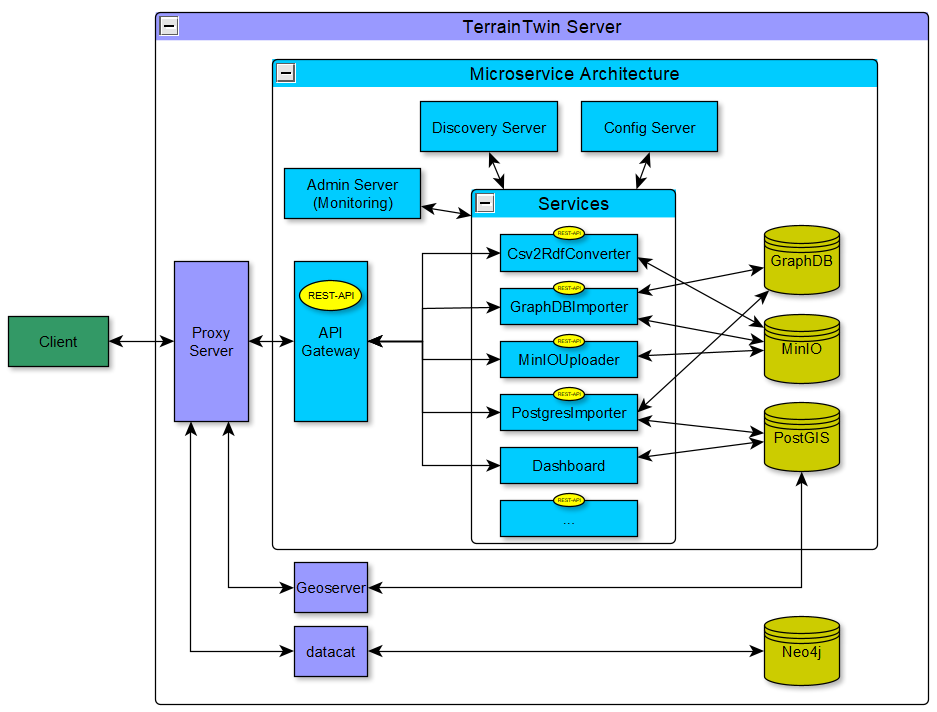
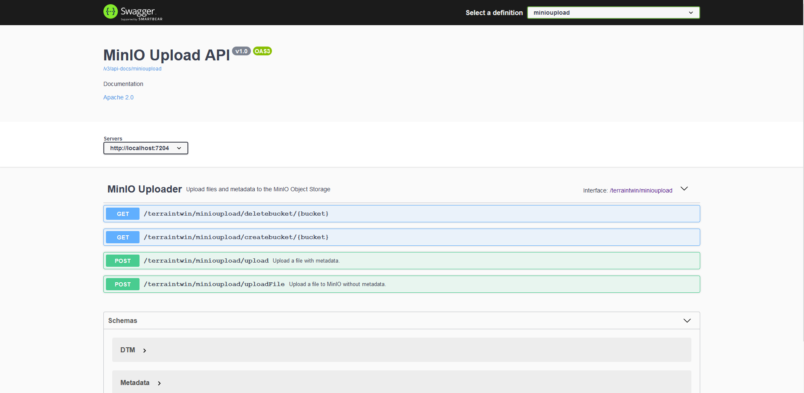

# Microservice Architektur TerrainTwin

Die Microservie Architektur verbindet Programme und Funktionen für das Projekt TerrainTwin und stellt diese über eine einheitlich über eine REST-Schnittstelle bereit. 

- Grundlage für die Microservice Architektur ist das Spring Boot Framework (Java)
- für die Veröffentlichung der REST-API wird OpenAPI 3 verwendet 
- dieses [Tutorial](https://t2informatik.de/blog/softwareentwicklung/microservices-mit-spring-boot-und-docker-erstellen-teil-1/) wird als Grundlage verwendet

## Aufbau, Funktionsweise und Starten der Microservice Architektur



### Komponenten
[Discovery Server](#discovery-server)  
[Config Server](#config-server)  
[Gateway Service](#gateway-service)  
[MinIO Upload Service](#minio-upload-service)  
[GraphDB Import Service](#graphdb-import-service)  
[Csv2Rdf Converter Service](#csv2rdf-converter-service) 
[Postgres Import Service](#postgres-import-service)   
... to be continued.

#### Discovery Server (Port:`9091`)

- dient als Manager-Dienst
- bei ihm registrieren sich alle Instanzen der Microservices
- ermöglicht mehrere Instanzen eines Microservice laufen zu haben
- koordiniert Kommunikation zwischen Diensten
- Hochverfügbarkeit erforderlich

#### Config Server (Port:`8888`)

- Verwaltung und Versionierung der Eigenschaftsdateien zu jedem Microservice
- Hochverfügbarkeit erforderlich
- Services hohlen sich vom Config Server ihre Eigenschaften
- Änderungen der Eigenschaften werden an alle Microservices übermittelt, ohne diese neu starten zu müssen
- Dateien liegen in einem lokalen Ordner centralProperties oder in einem gleichnamigen Git-Repository
- Datei `application.yml` kann von jedem Service gelesen werden
- enthält alle Zugangsdaten, die die Microservices verwenden
- kann generell für Eigenschaften genutzt werden, die von allen Services genutzt werden 
- für jeden Service wird Eigenschaftsdatei mit der Struktur servicename-profile.yml bereitgestellt
- diese enthält z.B. den Port, über den der Service zugänglich ist sowie die Definition der REST-Schnittstelle
- Zugang zu Config Server ist mit Benutzername, Passwort geschützt, welche in der `application.yml` des Server definiert werden
- jeder Service enthält ebenfalls eine `application.yml`, in der die URL sowie die Zugangsdaten angegeben werden


#### Gateway Service (Port:`8084`)

- organisiert Verfügbarkeit der Microservices über einen Endpunkt
- stellt REST-API's der Microservices nach außen bereit
- kann für Authentifizierung und Sicherheitsüberprüfung verwendet werden

#### MinIO Upload Service (Port:`7204`)

- Erstellen von Buckets im MinIO Object Storage
- Löschen von Buckets mit samt deren enthaltenen Dateien
- Hochladen von Dateien
- Hochladen einer Datei + Angabe von Metadaten sowie deren Upload als Json-Datei
- alle Metadaten sind optional
- HTML-Interface verfügbar

**Metadatenstruktur inklusive Angabe des Dateipfades und des Zielordners:**
```schell script
{
  "file": "string",
  "bucket": "string",
  "DIN SPEC 91391-2": {
    "type": "string",
    "description": "string",
    "creator": "string",
    "sender": "string",
    "recipients": "string",
    "suitability": "string",
    "revision": "string",
    "version": "string",
    "status": "string",
    "projectId": "string",
    "metadataSchema": "string",
    "schema": "string",
    "schemaVersion": "string",
    "schemaSubset": "string"
  },
  "DIN 18740-6": {
    "aktualitaet": "string",
    "lagereferenzsystem": "string",
    "hoehenreferenzsystem": "string",
    "projektion": "string",
    "raeumlicheAusdehnung": "string",
    "datenstruktur": "string",
    "darstellungsform": "string",
    "erfassungsmethode": "string",
    "messgenauigkeit": "string",
    "innereGenauigkeit": "string",
    "aeußereGenauigkeit": "string"
  }
}
```

#### GraphDB Import Service (Port:`7201`)

- Angabe eines MinIO Bucket als Quellordner und eines GraphDB Repositories als Zieldatenbank
- Ordner wird nach serialisierten RDF-Dateien mit den Endungen `.ttl`, `.rdf`, `.owl` durchsucht und diese werden nach GraphDB importiert
- `JSON`-Dateien mit "_metadata_" im Namen werden als Triple in `Turtle`-Syntax serialisiert und in die Datenbank geschrieben
- leere Metadaten werden dabei ignoriert
- Namespace der Triple wird, wenn vorhanden, auf Dateipfad der beschriebenen Datei gesetzt
- Standardnamespace ist "_https://terrain.dd-bim.org/_" + Dateiname
- GraphDB verhindert automatisch redundanten Import von Tripeln 
- HTML-Interface verfügbar

#### Csv2Rdf Converter Service (Port:`7202`)

- convertiert lokale `CSV`-Dateien in mit `Turtle` serialisierte `RDF`-Dateien
- möglich ist die Eingabe von:
  - file
  - file, delimiter
  - file, namespace, prefix, superclass 
  - file, namespace, prefix, superclass, delimiter
- file ist der Dateipfad
- Standard-Delimiter: ;
- Standard-Namespace: http://example.org/Sachdaten/
- Standard-Präfix: ns 
- Standard-Superklasse: Sachdaten
- Werte der Kopfzeile der CSV-Tabelle werden als DatatypeProperties der Superklasse interpretiert
- jede Zeile wird als Ressource mit eindeutiger ID aus der Spalte ID erzeugt
- jeder Ressource werden die weiteren Attribute als Instanzen ihrer jeweiligen DatatypeProperties angehangen
- Tripel werden als `Turtle` serialisiert und am Ort der Quelldatei als Datei gespeichert
- `GUI` für lokale Ausführung verfügbar

#### Postgres Import Service (Port:`7203`)

- Angabe eines MinIO Bucket als Quellordner und einer Postgres Datenbank als Zieldatenbank
- Prüfung ob Datenbank bereits über Tabellen für TIN, Breaklines und Surfaces verfügt, wennn nicht wird Schemadatei zur Erstellung dieser ausgeführt
- Bucket wird nach Dateien mit den Endungen `.xml`, `.txt`, `.csv` durchsucht
- ist die `XML`-Datei eine LandXML-Datei werden darin TIN's gesucht und deren Points und Faces werden in ein `WKT-TIN` umgewandelt
- `TIN` wird in die Datenbank importiert
- existieren Breaklines werden diese als `WKT-LINESTRING` in die Datenbank importiert 
- `TXT`- und `CSV`-Dateien werden nach `WKT`-Flächen durchsucht und diese werden in die Datenbank importiert
- HTML-Interface verfügbar


### allgemeine Ordnerstruktur
  - Komponentenname
    - pom.xml
    - src/main
      - java/com/Microservices
        - ...Application.java
        - controller
        - domain/model
        - service
      - resources
        - application.yml

### Funktionsweise Code
- Application.java enthält die Main-Class zum starten der Anwendung und die allgemeine API Definition
- domain/model enthält Klassen und deren Methoden
- service enthält die Funktionalität des Services
- controller enthält die REST-Schnittstellen Definitionen sowie teilweise Schnittstellen für Nutzung des Service über eine HTML-Datei im Browser bzw. eine GUI
- application.yml enthält Einstellungen zu Discovery und Config Server
- jede Komponete wir mit der jeweiligen Application.java gestartet
- Server werden zuerst gestartet, der Gateway Service zuletzt 
- Services registrieren sich beim Discovery Server
- Services loggen sich im Config Server ein und laden dort befindliche Eigenschaftsdatein, je nach aktivem Profil
- Gateway Server stellt durch Routing alle Services über einen Port(`8084`) bereit 
- geroutete API Definitionen der einzelnen Services werden in der GatewayServiceApplication.java gesammelt und als gebündelte REST-API bereitgestellt

## REST-API

- wird von jedem Microservice bereitgestellt
- Gateway bündelt die REST-API's
- Interfaces sind zusätzlich verlinkt
- Requests können direkt in API über Button "Try it out" verwendet werden



## weitere hilfreiche Quellen:

### Microservices:

https://spring.io/microservices  
https://spring.io/blog/2015/07/14/microservices-with-spring  
https://spring.io/guides/tutorials/rest/  
https://medium.com/an-idea/spring-boot-microservices-api-gateway-e9dbcd4bb754
https://programmingtechie.com/2021/03/25/spring-boot-microservices-project-tutorial-part-2/#Centralized_Configuration_using_Spring_Cloud_Config_Server


### Springdoc (Swagger 3.0.3):

https://reflectoring.io/spring-boot-springdoc/  
https://springdoc.org/#properties  
https://piotrminkowski.com/2020/02/20/microservices-api-documentation-with-springdoc-openapi/
